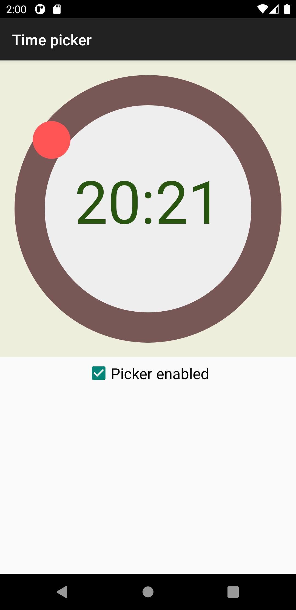

# TimePicker
A customizable time picker component for Android. This is a fork of [ugurtekbas's dialTimePicker](https://github.com/ugurtekbas/dialTimePicker).

Minimum API level: **16 (Jelly Bean 4.1.x)**

[](https://jitpack.io/#Sztorm/TimePicker)




## Usage

### Setting dependencies

Add it to your project build.gradle
```groovy
repositories {
    maven {
        url "https://jitpack.io"
    }
}
```

Add it to your app build.gradle
```groovy
dependencies {
    implementation 'com.github.Sztorm:TimePicker:1.1.0'
}
```

### Setting attributes via XML

```xml
<com.sztorm.timepicker.TimePicker
    android:id="@+id/picker"
    android:layout_width="match_parent"
    android:layout_height="match_content"
    app:canvasColor="#EEEEDD"
    app:clockFaceColor="#EEEEEE"
    app:pointerColor="#FF5555"
    app:trackColor="#785757"
    app:textColor="#285510"
    app:disabledCanvasColor="#EEEEDD"
    app:disabledClockFaceColor="#EEEEEE"
    app:disabledPointerColor="#705B5B"
    app:disabledTrackColor="#595151"
    app:disabledTextColor="#6C8061"
    app:trackSize="40dp"
    app:pointerRadius="25dp"
    app:is24Hour="true"
    app:isTrackTouchable="true" />
```

### Setting attributes programmatically

This is an exact equivalent to the picker above.

```xml
<com.sztorm.timepicker.TimePicker
    android:id="@+id/picker"
    android:layout_width="match_parent"
    android:layout_height="match_parent" />
```

```kotlin
// Needed for getting dip values.
fun dpToPx(dp: Float): Float = TypedValue
    .applyDimension(TypedValue.COMPLEX_UNIT_DIP, dp, Resources.getSystem().displayMetrics)
    
// Place it in method which retrieves view like onCreateView or onBindViewHolder
val picker: TimePicker = view.findViewById(R.id.picker)

picker.canvasColor = Color.parseColor("#EEEEDD")
picker.clockFaceColor = Color.parseColor("#EEEEEE")
picker.pointerColor = Color.parseColor("#FF5555")
picker.trackColor = Color.parseColor("#785757")
picker.textColor = Color.parseColor("#285510")
picker.disabledCanvasColor = Color.parseColor("#EEEEDD")
picker.disabledClockFaceColor = Color.parseColor("#EEEEEE")
picker.disabledPointerColor = Color.parseColor("#705B5B")
picker.disabledTrackColor = Color.parseColor("#595151")
picker.disabledTextColor = Color.parseColor("#6C8061")
picker.trackSize = dpToPx(40F)
picker.pointerRadius = dpToPx(25F)
picker.is24Hour = true
picker.isTrackTouchable = true
```

### Other useful features

 * Setting time

```kotlin
// 24-hour formatted time
picker.setTime(16, 20)

// 12-hour formatted time
picker.setTime(4, 20, TimePicker.PM)

// Setting time via Calendar object
val calendar = Calendar.getInstance()
calendar[Calendar.HOUR_OF_DAY] = 16
calendar[Calendar.MINUTE] = 20

amPmPicker.setTime(calendar, is24Hour = true)
```

 * Setting timeChangedListener

```kotlin
picker.timeChangedListener = TimeChangedListener { time ->
    Log.i("TimePicker", time.toString())
}
```

 * Getting state-related values

```kotlin
// Returns current picked hour in 24-hour time format
val pickedHour: Int = picker.hour

// Returns current picked hour in time format specified by is24Hour property
val pickedHourFormatted: Int = picker.hourFormatted

// Returns current picked minute
val pickedMinute: Int = picker.minute

// Returns current picked time. Useful for using the time without keeping the picker reference.
val pickedTime: PickedTime = picker.time

// Values related to 12-hour formatted time
val isAm: Boolean = picker.isAm
val isPm: Boolean = picker.isPm

// The is24Hour property can be mutated to change picker's behavior to show 12-hour or 24-hour
// formatted time.
// In case of getting the information whether the picker is displaying 24-hour formatted time,
// is24Hour can be safely get without causing picker's state mutation.
val is24HourFormat = picker.is24Hour

if (is24HourFormat) {
    picker.is24Hour = false
}
```

 * Working with *PickedTime*
 
```kotlin
// When PickedTime is obtained via TimePicker's time property it is no longer dependent from
// TimePicker and can be safely passed everywhere.
val pickedTime: PickedTime = picker.time

// PickedTime offers time related properties that work exactly like their equivalents in
// TimePicker class.
val hour: Int = pickedTime.hour
val hourFormatted: Int = pickedTime.hourFormatted
val minute: Int = pickedTime.minute
val is24Hour: Boolean = pickedTime.is24Hour
val isAm: Boolean = pickedTime.isAm
val isPm: Boolean = pickedTime.isPm

// PickedTime can be converted to String with format chosen by the user.
val timeIn24HFormat: String = pickedTime.toString24HourFormat()
val timeIn12HFormat: String = pickedTime.toString12HourFormat()

// toString() returns picked time String with time format specified by is24Hour property.
val timeAutoFormat: String = timepickedTime.toString()
```

## License

```
Copyright 2021 Sztorm

Licensed under the Apache License, Version 2.0 (the "License");
you may not use this file except in compliance with the License.
You may obtain a copy of the License at

 http://www.apache.org/licenses/LICENSE-2.0

Unless required by applicable law or agreed to in writing, software
distributed under the License is distributed on an "AS IS" BASIS,
WITHOUT WARRANTIES OR CONDITIONS OF ANY KIND, either express or implied.
See the License for the specific language governing permissions and
limitations under the License.
```
[More about license](LICENSE)
